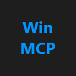

<p align="center">
  
</p>

<h1 align="center">WinApp MCP</h1>

<p align="center">
  <strong>Playwright for Windows Desktop Apps</strong>
  <br><br>
  A Model Context Protocol (MCP) server that gives AI assistants full control over native Windows applications — launch, inspect, click, type, screenshot, and test any WinUI3, WPF, WinForms, UWP, or Win32 app.
</p>

<p align="center">
  <a href="#installation"></a>
  
  
  
  
  
  
</p>

---

## Why This Exists

Browser automation has Playwright. Mobile has Appium. **Windows desktop had nothing** — until now.

AI assistants like GitHub Copilot, Claude, and ChatGPT can browse the web, run terminal commands, and edit files. But they **cannot interact with native Windows applications**. They can't click a button in your WinUI3 app, read a value from a WPF form, or test a WinForms dialog.

**WinApp MCP bridges that gap.** It exposes 55 UI automation tools through the [Model Context Protocol](https://modelcontextprotocol.io), letting any MCP-compatible AI assistant control Windows desktop apps the same way Playwright controls browsers.

### The Problem

| What AI Can Do Today | What AI Couldn't Do |
|:---|:---|
| ✅ Edit source code | ❌ Launch and interact with the compiled app |
| ✅ Run terminal commands | ❌ Click buttons, fill forms, read UI state |
| ✅ Browse websites via Playwright | ❌ Automate desktop apps |
| ✅ Write tests | ❌ **Run visual/E2E tests on desktop apps** |
| ✅ Run long autonomous pipelines | ❌ **Keep working when the app is minimized or the screen locks** |

### The Solution

WinApp MCP gives AI assistants **eyes and hands** for any Windows desktop application:

```
┌─────────────────────┐      MCP (stdio)      ┌──────────────────────┐
│   AI Assistant       │◄─────────────────────►│   WinApp MCP Server  │
│   (Copilot, Claude)  │   JSON-RPC over stdio │   (.NET 8 + FlaUI)   │
└─────────────────────┘                        └──────────┬───────────┘
                                                          │ UI Automation
                                                          ▼
                                               ┌──────────────────────┐
                                               │  Windows Application │
                                               │  WinUI3/WPF/WinForms│
                                               └──────────────────────┘
```

---

## Key Features

### 🔍 Deep UI Inspection
- **DOM-like snapshots** of the entire UI element tree with configurable depth
- **Filtered search** by control type, AutomationId, or name
- **Fuzzy matching** with Levenshtein distance — tolerates typos and partial names
- **Element existence checks** — fast boolean queries without full property reads

### 🖱️ Complete Interaction
- Click, double-click, right-click, invoke (via UIA patterns)
- Type text, press keys, key combos (Ctrl+S, Alt+F4, etc.)
- **Fill entire forms** in a single call — no sequential typing
- Select dropdown options in one atomic operation
- Drag and drop between elements
- Expand/collapse tree items, menus, and accordions

### 🪟 Multi-Window HWND Targeting
- Target specific windows by native handle (HWND)
- Click, set values, and take snapshots of popups, dialogs, and secondary windows
- Essential for multi-window applications and system dialogs

### ⚡ Performance-Optimized
- **Descendant cache** (2s TTL) — avoids repeated `FindAllDescendants` calls that take 200-800ms on complex apps
- **Window cache** (30s TTL) — eliminates expensive window lookups
- **Smart cache invalidation** — cache is cleared automatically after mutations (click, type, navigate)
- **Token-aware screenshots** — auto-resize images to fit within LLM context limits

### 📊 Advanced UIA Patterns
- **GridPattern** — direct cell access by row/column in DataGrids
- **ScrollItemPattern** — scroll off-screen elements into view
- **VirtualizedItemPattern** — realize items in WinUI3 virtualized lists (ListView, GridView)
- **ExpandCollapsePattern** — programmatic expand/collapse for tree items and menus
- **ItemContainerPattern** — efficient search in large/virtualized containers

### 📡 Event Monitoring
- Monitor **focus changes**, **structure changes** (elements added/removed), and **property changes** in real-time
- Session-based with 500-event ring buffer
- Debug async UI updates, animations, and background data loads

### 📸 Visual Verification
- Screenshot capture with auto-resize for LLM token budgets
- **Annotated screenshots** — red bounding boxes drawn around specified elements
- **Pixel-diff comparison** — compare two screenshots and highlight changes
- HWND-targeted screenshots for specific windows

### 🪟 Minimized & Locked Session Support
- **Works when apps are minimized** — auto-restores windows before mouse/keyboard operations, uses `PrintWindow` API for screenshots without needing to restore
- **Works when the desktop is locked** — clicks via UIA patterns (InvokePattern, TogglePattern, SelectionItemPattern) instead of mouse simulation; reads/writes values via ValuePattern; captures screenshots via `PrintWindow`
- **Smart fallback chain** — tries UIA pattern → auto-restore + mouse simulation → informative error
- **Session status detection** — `check_session_status` reports whether the session is locked, the app is minimized, and which operations are available
- **Manual restore** — `restore_window` brings a minimized app back to foreground on demand

> **Why it matters:** AI agents running long autonomous pipelines shouldn't break because a screensaver kicked in or the user minimized the app. WinApp MCP degrades gracefully — UIA pattern-based operations keep working even when mouse/keyboard simulation can't.

### 🛡️ Safety
- **Emergency release** — unstick all modifier keys and mouse buttons with one call
- **Wait primitives** — wait for elements, conditions, and input idle states
- **Timeout controls** on all blocking operations

---

## Use Cases

### 🤖 AI-Powered E2E Testing
Let AI assistants test your Windows app the way a QA engineer would — navigate pages, fill forms, verify data, test status transitions, capture evidence.

```
"Navigate to Invoices → Create New → Fill all fields → Save → Verify detail page → Test status change to Sent"
```

### 🔄 Automated UI Verification
After code generation or refactoring, have the AI launch the app and verify that the UI renders correctly, buttons work, and forms validate properly.

### 🧪 Visual Regression Testing
Take baseline screenshots, make changes, take new screenshots, and use `screenshot_diff` to detect unexpected visual changes.

### 📋 Form Automation & Data Entry
Fill complex multi-field forms in a single `fill_form` call. Automate repetitive data entry across desktop applications.

### 🏗️ CI/CD Desktop Testing
Integrate into build pipelines to automatically test desktop applications after each build. The MCP server runs headless-compatible via stdio transport.

### 🔍 Accessibility Auditing
Inspect the UI Automation tree to verify that all controls have proper AutomationIds, names, and patterns — critical for screen reader compatibility.

---

## Installation

### Option 1: VS Code Extension (VSIX) — Recommended

The easiest way to get started. The VSIX bundles the pre-built MCP server — no .NET SDK required.

1. Download the latest `.vsix` file from [Releases](https://github.com/nicobrinkkemper/winapp-mcp/releases)
2. In VS Code: `Ctrl+Shift+P` → **"Extensions: Install from VSIX..."** → select the `.vsix` file
3. Reload VS Code
4. The MCP server registers automatically on startup

**To verify:** Open Copilot Chat → type any prompt that would need Windows app interaction → the `winapp-mcp` tools should appear in the tool list.

> **Manual Registration:** If tools don't appear automatically, run `Ctrl+Shift+P` → **"WinApp MCP: Register Server"**

### Option 2: Manual MCP Configuration

If you prefer direct control, add the server to your VS Code MCP settings.

**Using pre-built binary:**

Add to `.vscode/mcp.json` in your workspace:

```json
{
  "servers": {
    "winapp": {
      "type": "stdio",
      "command": "path/to/WinAppMCP.exe"
    }
  }
}
```

**Using `dotnet run`:**

```json
{
  "servers": {
    "winapp": {
      "type": "stdio",
      "command": "dotnet",
      "args": ["run", "--project", "path/to/src"]
    }
  }
}
```

### Option 3: Build from Source

```powershell
git clone https://github.com/nicobrinkkemper/winapp-mcp.git
cd winapp-mcp/src
dotnet build
dotnet run
```

**Publish as self-contained executable (no .NET SDK needed on target):**

```powershell
dotnet publish -c Release -r win-x64 --self-contained
# Output: bin/Release/net8.0-windows10.0.19041.0/win-x64/publish/WinAppMCP.exe
```

---

## ⚠️ Caution & Important Notes

> **This tool controls your mouse and keyboard.** When automation is running, it will move your cursor, click buttons, and type text. Do not interact with your computer while tests are executing — it can interfere with the automation and produce unexpected results.
>
> **Minimized/locked mode:** When the app is minimized or the session is locked, WinApp MCP automatically falls back to UIA patterns (InvokePattern, ValuePattern) and `PrintWindow` for screenshots — no mouse or keyboard simulation is used in this mode.

### Before You Start

- **Close sensitive applications** — The tool can list all visible windows and their titles. Keep private apps closed during automation sessions.
- **Save your work** — Automation interacts with live applications. An incorrect click could close unsaved work in other apps.
- **Single session** — Run one automation session at a time. Concurrent sessions can cause mouse/keyboard conflicts.

### During Automation

- **Don't touch mouse/keyboard** — Let the automation complete. Moving your mouse mid-operation can cause clicks to miss their targets.
- **Use `release_all`** — If automation stops unexpectedly and your Ctrl/Shift/Alt keys feel "stuck", call `release_all` to reset.
- **Watch timeouts** — All blocking operations have timeouts. If an element doesn't appear, the call will fail gracefully rather than hang.

### Known Limitations

- **Windows only** — Requires Windows 10 version 1903+ or Windows 11
- **UI Automation dependency** — Target apps must expose a UIA tree. Fully custom-drawn apps (DirectX/OpenGL games, Electron with custom rendering) may have limited or no UIA support.
- **No cross-process clipboard writing** — `get_clipboard` reads clipboard content but doesn't write to it
- **Process-scoped** — The server attaches to one app at a time per app ID. Use multiple app IDs for multi-app workflows.
- **Screen resolution** — Screenshot coordinates are absolute. Automation on remote desks or varying DPI may need adjustment.
- **Administrator apps** — If the target app runs as Administrator, the MCP server must also run elevated.
- **Single monitor optimized** — Multi-monitor coordinate translation is not handled automatically
- **Locked session limits** — When the desktop is locked (Win+L), operations using UIA patterns (click via Invoke, read/write values, take screenshots via PrintWindow) work, but raw mouse/keyboard simulation does not. The server auto-detects this and uses pattern-based fallbacks where possible.

---

## Tools Overview

WinApp MCP exposes **55 tools** organized into 10 categories:

### App Lifecycle (5 tools)

| Tool | Description |
|:---|:---|
| `launch_app` | Launch a Windows app by executable path |
| `attach_to_app` | Attach to a running process by name |
| `attach_to_pid` | Attach to a running process by PID |
| `close_app` | Close a tracked application |
| `list_apps` | List all currently tracked applications |

### Window & Element Discovery (7 tools)

| Tool | Description |
|:---|:---|
| `list_windows` | List all windows of a tracked app |
| `list_desktop_windows` | List all visible desktop windows |
| `get_snapshot` | Get a UI tree snapshot (like browser DOM inspection) |
| `get_focused_element` | Get the currently focused element's info |
| `find_elements` | Search for elements with filters (type, id, name) |
| `find_all_elements` | List all matching elements with indices |
| `find_elements_fuzzy` | Fuzzy search — tolerates typos and partial names |

### Read & Inspect (5 tools)

| Tool | Description |
|:---|:---|
| `read_element` | Read detailed properties of a UI element |
| `read_element_by_index` | Read properties by index (from `find_all_elements`) |
| `get_element_bounds` | Get bounding rectangle (screen coordinates) |
| `element_exists` | Fast boolean check — does this element exist? |
| `get_all_values` | Read all editable field values at once |

### Click & Interaction (8 tools)

| Tool | Description |
|:---|:---|
| `click_element` | Click a UI element by AutomationId or name |
| `double_click_element` | Double-click a UI element |
| `right_click_element` | Right-click (open context menu) |
| `click_at_coordinates` | Click at absolute screen coordinates |
| `invoke_element` | Invoke via UIA InvokePattern/TogglePattern |
| `select_option` | Select a ComboBox/dropdown option in one call |
| `expand_collapse_element` | Expand, collapse, or toggle tree/menu items |
| `drag_element` | Drag from one element to another |

### Input (4 tools)

| Tool | Description |
|:---|:---|
| `type_text` | Type text into a text field |
| `press_key` | Press a single key (RETURN, TAB, ESCAPE, etc.) |
| `press_key_combo` | Press a key combination (Ctrl+S, Alt+F4) |
| `fill_form` | Fill multiple form fields in one call |

### Wait & Sync (4 tools)

| Tool | Description |
|:---|:---|
| `wait_for_element` | Wait for an element to appear |
| `wait_for_condition` | Wait for a property to reach a value |
| `wait_for_input_idle` | Wait for window to be ready for input |
| `release_all` | Emergency: release all stuck modifier keys |

### Screenshots & Visual (5 tools)

| Tool | Description |
|:---|:---|
| `take_screenshot` | Capture app window as PNG |
| `take_screenshot_optimized` | Screenshot with auto-resize for LLM token budgets |
| `annotate_screenshot` | Draw red bounding boxes around elements |
| `screenshot_diff` | Pixel-diff two screenshots, highlight changes |
| `get_tree_hash` | Hash the UI tree to detect changes |

### HWND Multi-Window (3 tools)

| Tool | Description |
|:---|:---|
| `click_element_hwnd` | Click in a specific window by handle |
| `set_value_hwnd` | Set text in a specific window by handle |
| `get_snapshot_hwnd` | UI snapshot of a specific window by handle |

### Advanced Patterns (6 tools)

| Tool | Description |
|:---|:---|
| `get_grid_item` | Access a DataGrid cell by row/column |
| `find_item_by_property` | Search in containers (ItemContainerPattern) |
| `scroll_into_view` | Scroll an element into the visible area |
| `realize_virtualized_item` | Load a virtualized item into the UI tree |
| `scroll_element` | Scroll within a scrollable container |
| `invalidate_cache` | Force-refresh cached window references |

### Event Monitoring (3 tools)

| Tool | Description |
|:---|:---|
| `start_event_monitor` | Start monitoring UI events (focus/structure/property) |
| `stop_event_monitor` | Stop monitoring a session or all sessions |
| `get_event_log` | Read captured events from a monitoring session |

### Session & Window Management (2 tools)

| Tool | Description |
|:---|:---|
| `restore_window` | Restore a minimized window and bring it to foreground |
| `check_session_status` | Check if desktop is locked, app is minimized, and report available operations |

> 📖 **Full tool documentation with parameters, examples, and tips:** See [DOCUMENTATION.md](DOCUMENTATION.md)

---

## Quick Start

### Example 1: Launch and Inspect an App

```
User: "Open Notepad and show me the UI tree"

AI calls:
  1. launch_app(exePath: "C:\\Windows\\notepad.exe")        → "app_1234"
  2. get_snapshot(appId: "app_1234", maxDepth: 3)           → UI tree
```

### Example 2: Fill a Form and Save

```
User: "Create a new invoice in the app"

AI calls:
  1. attach_to_app(processName: "MyApp")                   → "app_5678"
  2. click_element(appId: "app_5678", name: "Invoices")     → navigates
  3. wait_for_element(appId: "app_5678", name: "New")       → page loaded
  4. click_element(appId: "app_5678", name: "New")          → opens form
  5. fill_form(appId: "app_5678", fieldsJson: {             → fills all fields
       "CustomerComboBox": "Acme Corp",
       "ItemName": "Widget",
       "Quantity": "10"
     })
  6. click_element(appId: "app_5678", name: "Save")         → saves
  7. take_screenshot(appId: "app_5678", outputPath: "...")   → evidence
```

### Example 3: Test Status Transitions

```
User: "Test the invoice lifecycle"

AI calls:
  1. click_element(appId: "app_5678", name: "Mark as Sent")
  2. wait_for_condition(appId: "app_5678", property: "name",
       expectedValue: "Sent", automationId: "StatusBadge")
  3. element_exists(appId: "app_5678", name: "Record Payment")  → "true"
  4. click_element(appId: "app_5678", name: "Record Payment")
  5. take_screenshot_optimized(appId: "app_5678", outputPath: "...", maxTokens: 1000)
```

---

## Performance

WinApp MCP is optimized for AI agent workflows where the same UI is inspected multiple times in quick succession:

| Operation | Without Cache | With Cache | Improvement |
|:---|:---|:---|:---|
| `get_snapshot` (complex app) | 400-800ms | 50-100ms | **8x faster** |
| `find_elements` (50 results) | 300-600ms | 20-50ms | **12x faster** |
| `click_element` (by name) | 200-500ms | 30-80ms | **6x faster** |
| Window lookup | 100-300ms | <1ms | **300x faster** |

The **descendant cache** is the biggest win — `FindAllDescendants()` is the most expensive UIA operation, and AI agents typically call it 3-5 times per UI state. The 2-second TTL ensures fresh data while avoiding redundant traversals.

Cache is **automatically invalidated** after any mutation (click, type, set value) so you always get accurate results.

---

## Architecture

```
src/
├── Program.cs              # Entry point — .NET Generic Host + MCP server registration
├── WinAppTools.cs           # 55 MCP tool definitions (thin wrappers)
├── WinAppAutomation.cs      # Core automation engine (~2800 lines)
└── WinAppMCP.csproj         # .NET 8, FlaUI.UIA3 5.0.0, MCP 1.1.0
```

**Design Principles:**

- **Thin tool layer** — `WinAppTools.cs` contains only `[McpServerTool]` wrappers. Zero business logic.
- **Single automation engine** — `WinAppAutomation.cs` handles all UIA interactions, caching, and state management.
- **Static singleton** — One `WinAppAutomation` instance shared across all tool calls.
- **Stdio transport** — Clean JSON-RPC over stdin/stdout. Logging goes to stderr only.
- **No external dependencies beyond FlaUI** — No Selenium, no WebDriver, no COM interop wrappers.

### Technology Stack

| Component | Technology | Version |
|:---|:---|:---|
| Runtime | .NET | 8.0 |
| UI Automation | FlaUI.UIA3 | 5.0.0 |
| MCP Protocol | ModelContextProtocol | 1.1.0 |
| Hosting | Microsoft.Extensions.Hosting | 10.0.3 |
| Target OS | Windows | 10 (1903+) / 11 |
| Architecture | x64 | win-x64 |

---

## Comparison with Alternatives

| Feature | WinApp MCP | [CursorTouch/Windows-MCP](https://github.com/CursorTouch/Windows-MCP) | [locomorange/uiautomation-mcp](https://github.com/locomorange/uiautomation-mcp) |
|:---|:---|:---|:---|
| **Tools** | 55 | ~15 | 39 |
| **UIA Library** | FlaUI (managed) | FlaUI (managed) | Raw COM interop |
| **Runtime** | .NET 8 | .NET 8 | .NET 9 (Native AOT) |
| **Architecture** | Single process | Single process | 6 projects, multi-process |
| **Caching** | ✅ Descendant + Window | ❌ | ❌ |
| **Fuzzy Search** | ✅ Levenshtein distance | ❌ | ❌ |
| **HWND Targeting** | ✅ Full (click, value, snapshot) | ❌ | ✅ Partial |
| **Event Monitoring** | ✅ Focus, structure, property | ❌ | ✅ Focus only |
| **Grid Pattern** | ✅ | ❌ | ✅ |
| **Virtualization** | ✅ | ❌ | ❌ |
| **Screenshot Diff** | ✅ | ❌ | ❌ |
| **Form Fill** | ✅ Batch | ❌ | ❌ |
| **Token-aware Screenshot** | ✅ | ❌ | ❌ |
| **Drag & Drop** | ✅ | ❌ | ❌ |
| **Minimized App Support** | ✅ Auto-restore + PrintWindow | ❌ | ❌ |
| **Locked Session Support** | ✅ UIA pattern fallback | ❌ | ❌ |
| **VS Code Extension** | ✅ VSIX | ❌ | ❌ |

---

## Documentation

- **[DOCUMENTATION.md](DOCUMENTATION.md)** — Complete reference for all 55 tools with parameters, return values, examples, and tips
- **[CHANGELOG.md](CHANGELOG.md)** — Version history and release notes

---

## Requirements

- **OS:** Windows 10 (version 1903 / build 18362) or later, or Windows 11
- **Runtime:** .NET 8.0 SDK (for building from source) — not needed if using VSIX or pre-built binary
- **Editor:** VS Code 1.99+ with GitHub Copilot (for VSIX extension)
- **Target Apps:** Must expose a UI Automation tree (WinUI3, WPF, WinForms, UWP, most Win32 apps)

---

## Contributing

Contributions are welcome! Please:

1. Fork the repository
2. Create a feature branch (`git checkout -b feature/amazing-tool`)
3. Commit your changes (`git commit -m 'Add amazing-tool'`)
4. Push to the branch (`git push origin feature/amazing-tool`)
5. Open a Pull Request

### Development Setup

```powershell
git clone https://github.com/nicobrinkkemper/winapp-mcp.git
cd winapp-mcp/src
dotnet restore
dotnet build
dotnet run  # Starts the MCP server on stdio
```

---

## License

This project is licensed under the **MIT License** — see the [LICENSE](LICENSE) file for details.

---

<p align="center">
  <strong>Built for AI-powered Windows app testing.</strong>
  <br>
  If this helps your workflow, give it a ⭐
</p>
